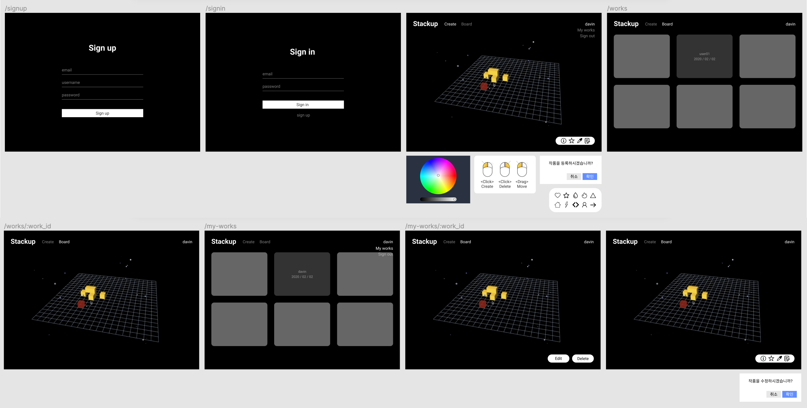

# Stackup


## Table of Contents
- [Introduction](#introduction)
- [Mock up](#mock-up)
- [Features](#features)
- [Getting started](#getting-started)
- [Settings](#settings)
- [Skills](#skills)
- [Test](#test)
- [Deployment](#deployment)
- [Versioning](#versioning)
- [Project Control](#project-control)
- [Challenges](#challenges)
- [Things to do](#things-to-do)

## Introduction
Stackup은 '쌓다'라는 의미입니다. 이름 그대로 3D 공간에서 큐브를 쌓아 올려 자신만의 작품을 만드는 웹 어플리케이션 입니다. 저는 평소에 그림에 관심이 많았는데, 이번 프로젝트에서 제 관심사인 그림과 관련된 어플리케이션을 만들어보고 싶었습니다. 여러 컨셉의 아이디어가 있었지만 비주얼적인 측면과 새로운 도전 등 다양한 요소들을 고려해 3D와 그림을 접목시키기로 하였습니다.

## Mock up



초기 목업입니다. Stackup은 사용자가 로그인하지 않아도 대부분의 기능을 이용할 수 있도록 만들고 싶었습니다. 그렇기 때문에 로그인을 하지 않아도 큐브를 쌓을 수 있고, 다른 사람의 작품을 볼 수 있도록 하였습니다. 회원 가입 페이지에서 가입을 마친 유저는 로그인 페이지로 이동하고, 로그인을 했다면 메인 페이지로 이동합니다. 메인 페이지에서 큐브를 쌓고 등록 버튼을 누르면 작품 리스트 페이지로 이동하여 다른 사람들의 작품과 함께 방금 등록한 사용자의 작품을 볼 수 있습니다. 또한 My Works로 이동하면 자신의 작품만 모아서 볼 수 있습니다.

## Features
- 로컬 회원 가입 / 로그인 기능
- 좌 클릭으로 큐브 쌓기 기능
- 우 클릭으로 큐브 삭제 기능
- 큐브 색상 변경 기능
- 샘플 불러오기 및 드래그 / 드롭 기능
- 줌인 / 줌아웃 기능
- 드래그로 시점 변경 기능
- 작품 등록 기능
- 작품 삭제 기능
- 다른 사람들의 작품 불러오기 기능
- 내 작품 모아보기 기능

## Getting started
### Client
```
  git clone https://github.com/davinjeong/stackup-client.git
  cd stackup-client
  npm install
  npm start
```

### Server
```
  git clone https://github.com/davinjeong/stackup-server.git
  cd stackup-server
  npm install
  npm start
```

## Settings
서버를 실행하고 싶다면 아래와 같은 환경 변수가 필요합니다.
```
/* .env */

DB=<DB_URL>
JWT_SECRET_KEY=<JWT_SECRET_KEY>
```

## Skills
### Client
- ES2015+
- React
- React Router
- Redux
- Redux Persist
- Three.js
- SCSS

### Server
- ES2015+
- Node.js
- Express
- MongoDB, Atlas
- Mongoose
- JSON Web Token Authentication

## Test
### Client
- Jest와 Enzyme를 이용한 Component 및 Reducer 단위 테스트
- Cypress를 이용한 End to End(E2E) 테스트


### Server
- Mocha와 Chai를 이용한 단위 테스트

## Deployment
- Netlify를 이용한 클라이언트 배포
- Circle CI를 이용한 빌드 자동화
- Amazon Web Service(AWS)의 Elastic Beanstalk을 이용한 서버 배포

## Versioning
- Git Repo를 구분하여 Client와 Server를 독립적으로 관리
- Git flow를 이용한 브랜치 관리

## Project Control
- Figma를 이용한 목업 작업
- LucidChart를 이용한 스키마 디자인
- Notion을 이용한 Task 관리

## Challenges
- Three js에 예시가 잘 나와있었기 때문에 큐브를 쌓는 것 자체는 어렵지 않았습니다. 초반에 Three js를 이해하고 공부하기 위해 많은 시간을 썼습니다. 프로젝트를 하면서 Three js를 얕게나마 공부했지만 추후에 더 깊이 있게 공부해보고 싶습니다.
- 기능 중 하나인 '큐브 색상 바꾸기'를 구현하면서 React 렌더링에 대해 공부하는 시간이 되었습니다. 쌓거나 삭제한 큐브 정보를 배열에 저장하는데 큐브 색상을 바꾸는 등 State가 바뀌면서 다시 렌더링 되고 배열에 저장한 큐브 정보를 모두 잃어버리는 현상이 있었습니다. 처음엔 State 때문에 모든 큐브 정보를 잃어버리니 큐브 정보를 배열 대신 Redux Store에 저장하여 State가 바뀔 때마다 Redux Store에 저장한 큐브 정보를 다시 불러오는 방향으로 해결하려 했습니다. 그러나 Three js에선 생성된 모든 것들이 트리 구조로 이루어져 있고, 각각의 고유한 uuid가 부여됩니다. State가 바뀌면서 새로 생성되는 큐브는 렌더링 최초에만 생성되는 `큐브를 쌓는 공간(부모)`을 찾지 못해 큐브를 쌓을 수 없었습니다. 그렇기 때문에 부모의 uuid를 저장하고 새로 쌓는 큐브의 부모를 저장한 부모 uuid로 지정하면 큐브를 쌓을 수 있지 않을까?라는 생각에 부모 요소들 또한 Redux Store에 저장해보기도 했습니다. 그러나 요소의 부모를 강제로 바꾸는데 어려움이 있었기에 고민을 하다가 최초 한 번만 실행하고 그 이상으로 바뀌지 않았으면 하는 요소들은 컴포넌트 영역 밖에 선언하는 것으로 해결하였습니다.
- 완성한 작품을 이미지로 바꾸어 DB에 저장하는 작업이 필요했는데, 캔버스 메소드 `toDataUrl` 을 이용하여 데이터를 가져올 수 있었습니다. 그러나 설정된 Full Size 캔버스의 데이터를 가져오기 때문에 용량이 꽤 컸고 서버에서도 용량 문제로 요청을 거부했습니다. 해결 방법을 찾던 중 캔버스를 작은 사이즈로 한 개 더 만든 후 원본 캔버스와 똑같이 작은 캔버스에 그려낸 후 작은 캔버스의 이미지를 DB에 저장하는 방법을 사용하였습니다. 

## Things to do
- 샘플 추가 및 수정
- 저장한 작품 수정 기능
- 배경 음악 및 효과음 추가
- Three js Unit Test 추가
- 버그 수정
